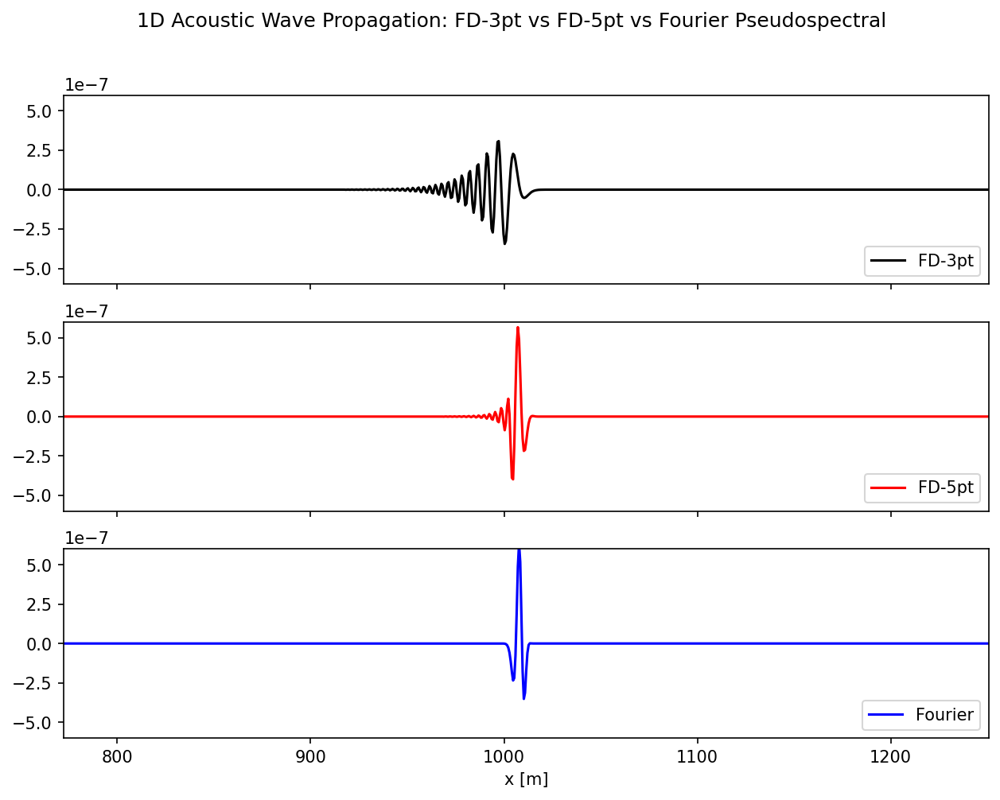

# 1D Acoustic Wave Equation: Finite Difference vs Fourier Pseudospectral Methods

A numerical methods project solving the 1D acoustic wave equation with three different
spatial discretization schemes, and comparing their accuracy and dispersion behavior.



## Overview

The 1D acoustic wave equation describes how pressure perturbations propagate through a
medium at a constant velocity. This project solves it using three numerical schemes for
the spatial derivative, all with the same second-order time extrapolation:

- **FD-3pt** — a standard 3-point (2nd order accurate) finite difference stencil
- **FD-5pt** — a 5-point (4th order accurate) finite difference stencil
- **Fourier Pseudospectral Method** — spatial derivatives computed via the FFT, which is
  exact for band-limited signals and avoids the numerical dispersion that finite difference
  schemes introduce at high frequencies

A Ricker wavelet source is injected at a fixed location, and the three solutions are
propagated forward in time and animated side by side so the differences in accuracy and
dispersion are directly visible.

## Project Structure

```
.
├── Fourier_Acoustic_Wave_in_1D.ipynb   # Main notebook
├── images/
│   └── wave_comparison.png             # Sample output snapshot
├── requirements.txt
└── README.md
```

## Getting Started

### Prerequisites

- Python 3.8+

### Installation

```bash
git clone https://github.com/YOUR_USERNAME/YOUR_REPO_NAME.git
cd YOUR_REPO_NAME
pip install -r requirements.txt
```

### Usage

Launch the notebook:

```bash
jupyter notebook Fourier_Acoustic_Wave_in_1D.ipynb
```

Run all cells. The notebook uses the `ipympl` interactive backend (`%matplotlib widget`) to
animate the wave propagation live inside the notebook.

To experiment:

- Change `nx` (grid points) or `nt` (time steps) to change resolution and simulation length
- Change `f0` (source frequency) to see how each method handles higher-frequency content
- Change `isx` (source location) to move where the wave originates

## Key Parameters

| Parameter | Meaning | Value |
|---|---|---|
| `c` | Acoustic velocity | 343 m/s |
| `eps` | Stability limit (Courant number) | 0.2 |
| `f0` | Source frequency | 60 Hz |
| `nx` | Grid points | 2024 |

## Background

This project applies concepts from numerical methods for PDEs, including finite difference
operators, CFL stability, and spectral methods for solving the wave equation.

## Author

**Tabassum Tariq**
BS Computational Physics, Centre for High Energy Physics (CHEP)
University of the Punjab, Lahore, Pakistan
[LinkedIn](https://linkedin.com/in/tabassum-tariq-a0415b36a)

## License

This project is open source and available for educational use.
